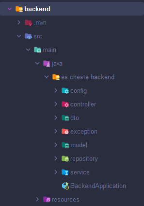
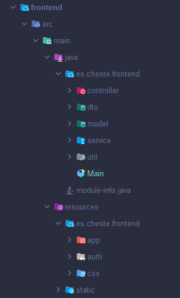

* * *

## Índice

1. [Comenzando](#comenzando-)
   2. [Explicación del proyecto](#expliación-del-proyecto-)
   3. [Explicación de la Base de Datos](#explicación-de-la-base-de-datos-)
   4. [Características principales](#características-principales-)
   5. [Estructura del proyecto](#esctructura-del-proyecto-)
      6. [Backend](#backend-)
      7. [Frontend](#frontend-)
   8. [Pre-requisito](#pre-requisitos-)
   9. [Instalación](#instalación-)
10. [Instrucciones de uso](#instrucciones-de-uso-)
11. [Construido con](#construido-con-)
12. [Autor](#autor-)
    13. [Contacto](#contacto-)
14. [Licencia](#licencia-)

* * *

## Comenzando 🚀

### Expliación del proyecto 📖

Este proyecto es una apliación de un diario personal, en el cual el usuario tiene que registrarse o iniciar sesión para
poder acceder a su diario. Los usuarios solo pueden escribir en la entrada del día que se encuentren, además la entrada
puede tener un título y ficheros.

Los usuarios pueden acceder a una lista con todas sus entradas, y acceder a ellas para visualizar lo que se escribio.
También se puede imprimir la entrada o elinimarla.

### Explicación de la base de datos 🛢️

Este proyecto es una aplicación de diario personal desarrollada con Java y JavaFX. La aplicación permite a los usuarios
gestionar sus entradas de diario, cambiar contraseñas y realizar otras operaciones relacionadas con la gestión de un
diario personal.

### Características principales ⭐

* _Inicio de sesión de usuario_: Los usuarios pueden iniciar sesión utilizando sus credenciales.
* _Gestión de entradas de diario_: Los usuarios pueden **crear**, **ver**, **editar**, **eliminar** e **imprimir**
  entradas de diario.
* _Cambio de contraseña_: Los usuarios pueden cambiar su contraseña a través de la interfaz de usuario.
* _Interfaz de usuario intuitiva_: La aplicación utiliza **JavaFX** para proporcionar una interfaz de usuario amigable y
  fácil de usar.
* _Persistencia de datos_: Los datos del usuario y las entradas del diario se gestionan mediante servicios que
  interactúan con una **base de datos**.

### Esctructura del proyecto 🏗️

#### Backend 🖥️

* **backend/src/main/java/es/cheste/backend/**: Contiene el código fuente del backend.
    * **controller/**: Controladores que manejan las solicitudes _HTTP_.
    * **dto/**: Objetos de transferencia de datos.
    * **exception/**: Clases de excepciones personalizadas.
    * **model/**: Clases de modelo que representan las entidades de la base de datos.
    * **repository/**: Interfaces de repositorio para operaciones _CRUD_.
    * **service/**: Clases de servicio que contienen la lógica de negocio.
    * **backend/src/main/resources/**: Contiene los recursos del backend.
        * **application.properties**: Archivo de configuración de la aplicación.

#### Frontend 🖥️

* **frontend/src/main/java/es/cheste/frontend/**: Contiene el código fuente del frontend.
    * **controller/**: Controladores que manejan la lógica de la interfaz de usuario.
    * **model/**: Clases de modelo utilizadas en el frontend.
    * **util/**: Clases de utilidad.
    * **view/**: Clases relacionadas con la vista.
    * **frontend/src/main/resources/es/cheste/frontend/**: Contiene los recursos del frontend.
        * **auth/**: Archivos relacionados con la autenticación.
        * **css/**: Archivos de estilos _CSS_.
        * **static/**: Imágenes para la visualización.

### Pre-requisitos 📋

Antes de comenzar, asegúrate de tener instalados los siguientes componenetes:

* **JDK 17**: [Descargar JDK](https://www.azul.com/downloads/?version=java-17-lts&package=jdk#zulu)
* **Apache Maven**: [Descargar Maven](https://maven.apache.org/download.cgi)
* **Git**: [Descargar Git](https://git-scm.com/downloads)
* **IntelliJ IDEA** (o cualquier otro IDE compatible con
  java): [Descargar IntelliJ IDEA](https://www.jetbrains.com/idea/download/?section=windows)
* **PostgreSQL**: [Descargar PostgreSQL](https://www.postgresql.org/download/)
* **Postman** (opcional): [Descargar Postman](https://www.postman.com/downloads/)

Además, asegúrate de tener configuradas las siguientes variables de entorno:

* **JAVA_HOME**: Debe apuntar al directorio de instalación del JDK.
* **MAVEN_HOME**: Debe apuntar al directorio de instalación de Maven.

Con estos pre-requisitos, estarás listo para clonar el repositorio y ejecutar el proyecto.

### Instalación 🔧

Para instalar y configurar el proyecto, sigue estos pasos:

1. Clonar el repositorio:

        git clone <URL_DEL_REPOSTORIO>
        cd <NOMBRE_DEL_REPOSITORIO>
2. Configurar la base de datos:

* Crea una base de datos en PostgreSQL.
* Actualiza el archivo [_application.properties_](backend/src/main/resources/application.properties) con las
  credenciales de tu base de datos:

        spring.datasource.url=jdbc:postgresql://localhost:5432/tu_base_de_datos
        spring.datasource.username=tu_usuario
        spring.datasource.password=tu_contraseña

3. Construir el proyecto con Maven:

        mvn clean install

* * *

## Instrucciones de uso ⚙️

Para utilizar la aplicación, sigue estos pasos:

1. Iniciar la aplicación:

Ejecutar el fichero [_BackendApplication.java_](backend/src/main/java/es/cheste/backend/BackendApplication.java) para
ejecutar la conexión a la base de datos y luego ejecutar [
_Main.java_](frontend/src/main/java/es/cheste/frontend/Main.java) para iniciar el frontend.

2. Registro e inicio de sesión:

* Regístrate como un nuevo usuario proporcionando tus credenciales.
* Inicia sesión con las credenciales registradas.

3. Gestión de entradas de diario:

* Escribe en la entrada del día actual
* Visualiza todas tus entradas
* Imprime entradas
* Elimina entradas

4. Cambio de contraseña:

* Si el usuario se olvida de su contraseña siempre podra cambiarla en la vista de iniciar sesión.
* Se ha de escribir 2 veces la misma contraseña.

* * *

## Construido con 🛠️

* **Java**: Lenguaje de programación principal utilizado.
* **Spring Boot**: Framework para el desarrollo del backend.
* **Maven**: Herramienta de gestión de dependencias y construcción del proyecto.
* **PostgreSQL**: Sistema de gestión de bases de datos utilizado.
* **JavaFX**: Framework para la creación de la interfaz de usuario del frontend.
* **Gson**: Biblioteca para la conversión entre objetos Java y JSON.
* **Log4j**: Biblioteca para el registro de logs en la aplicación.

* * *

## Autor ✒️

* Hugo Almodóvar Fuster - Desarrollador principal - [_Github_](https://github.com/HugoAlFus)

### Contacto 🤝🏻

* Correo electrónico: hugalmodovarfus@gmail.com
* Linkedln: [Hugo Almodóvar Fuster](https://www.linkedin.com/in/hugoalmodovar/)
* Github: [HugoAlFus](https://github.com/HugoAlFus)

* * *

## Licencia 📄

Este proyecto está licenciado bajo la Licencia MIT. Para más detalles, consulta el archivo [_LICENSE_](LICENSE.md)